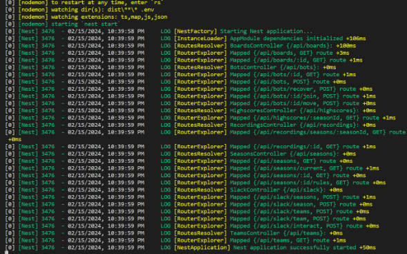
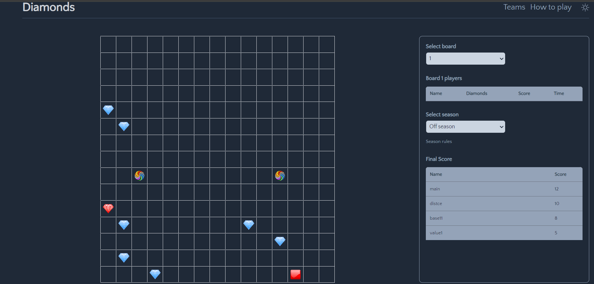
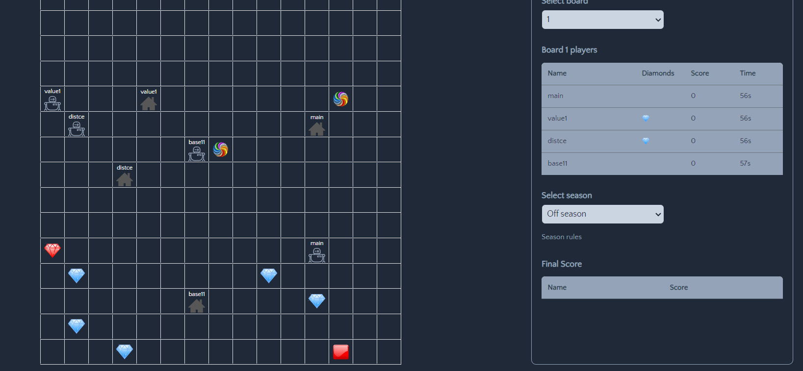

<h1 align="center">Tugas Besar 1 IF2211 Strategi Algoritma</h1>
<h1 align="center"> Semester II tahun 2023/2024 </h1>
<h1 align="center"> Pemanfaatan Algoritma Greedy dalam Pembuatan Bot Permainan Diamonds </h1>

<h1 align=""> Kelompok 28: terkeStima </h1>

| NIM      | Nama               | Kelas |
| -------- | ------------------ | ----- |
| 13522081 | Albert             | K-01  |
| 13522111 | Ivan Hendrawan Tan | K-01  |
| 10023519 | Muhammad Fikri     | K-01  |

## Table of Contents

- [Deskripsi Program](#deskripsi-program)
- [Requirements Program](#requirements-program)
  <!-- - [Screenshots](#screenshots) -->
- [Setup](#set-up-program)
- [Dokumentasi Program](#Dokumentasi-Program)
- [Link](#link)
<!-- <!-- * [License](#license) -- -->

## Deskripsi Program

Diamonds merupakan suatu programming challenge yang mempertandingkan bot yang anda buat dengan bot dari para pemain lainnya. Setiap pemain akan memiliki sebuah bot dimana tujuan dari bot ini adalah mengumpulkan diamond sebanyak-banyaknya. Cara mengumpulkan diamond tersebut tidak akan sesederhana itu, tentunya akan terdapat berbagai rintangan yang akan membuat permainan ini menjadi lebih seru dan kompleks. Untuk memenangkan pertandingan, setiap pemain harus mengimplementasikan strategi tertentu pada masing-masing bot-nya.

Program permainan Diamonds terdiri atas:

1. Game engine, yang secara umum berisi:
   - Kode backend permainan, yang berisi logic permainan secara keseluruhan serta API yang disediakan untuk berkomunikasi dengan frontend dan program bot
     -Kode frontend permainan, yang berfungsi untuk memvisualisasikan permainan
2. Bot starter pack, yang secara umum berisi:
   - Program untuk memanggil API yang tersedia pada backend
   - Program bot logic (bagian ini yang akan kalian implementasikan dengan algoritma greedy untuk bot kelompok kalian)
   - Program utama (main) dan utilitas lainnya

Repositori ini berisi implementasi algoritma greedy by highest density dalam pembuatan bot permainan diamonds. Greedy by Highest Density adalah strategi greedy yang mengutamakan densitas tertinggi dari hasil pembagian poin yang didapatkan dari sebuah diamond dibagikan dengan jarak yang harus ditempuh untuk mendapatkan diamond tersebut.

## Requirements Program

1. Game Engine
   Requirement yang harus di-install:
   - Node.js (https://nodejs.org/en)
   - Docker desktop (https://www.docker.com/products/docker-desktop/)
   - Yarn
   ```bash
   npm install --global yarn
   ```
2. Bot Starter Pack
   Requirement yang harus di-install

   - Python (https://www.python.org/downloads/)

## Set Up Program

1.  Jalankan game engine dengan cara mengunduh starter pack game engine dalam bentuk file .zip yang terdapat pada tautan berikut https://github.com/haziqam/tubes1-IF2211-game-engine/releases/tag/v1.1.0
    a. Setelah melakukan instalasi, lakukan ekstraksi file .zip tersebut lalu masuk ke root folder dari hasil ekstraksi file tersebut kemudian jalankan terminal

    b. Jalankan perintah berikut pada terminal untuk masuk ke root directory dari game engine

    ```bash
    cd tubes1-IF2110-game-engine-1.1.0
    ```

    c. Lakukan instalasi dependencies dengan menggunakan yarn.

    ```bash
    yarn
    ```

    Apabila terjadi Failed with error saat melakukan yarn maka lanjutkan ke step selanjutnya

    d. Lakukan setup environment variable dengan menjalankan script berikut untuk OS Windows

    ```bash
    ./scripts/copy-env.bat
    ```

    Untuk Linux / (possibly) macOS

    ```bash
    chmod +x ./scripts/copy-env.sh
    ./scripts/copy-env.sh
    ```

    e. Lakukan setup local database dengan membuka aplikasi docker desktop terlebih dahulu kemudian jalankan perintah berikut di terminal

    ```bash
    docker compose up -d database
    ```

    f. Kemudian jalankan script berikut. Untuk Windows

    ```bash
    ./scripts/setup-db-prisma.bat
    ```

    Untuk Linux / (possibly) macOS

    ```bash
    chmod +x ./scripts/setup-db-prisma.sh
    ./scripts/setup-db-prisma.sh
    ```

    g. Jalankan perintah berikut untuk melakukan build frontend dari game-engine

    ```bash
    npm run build
    ```

    h. Jalankan perintah berikut untuk memulai game-engine

    ```bash
    npm run start
    ```

    i. Jika berhasil, tampilan terminal akan terlihat seperti gambar di bawah ini.
    

2.  Jalankan bot starter pack dengan cara mengunduh kit dengan ekstensi .zip yang terdapat pada tautan berikut https://github.com/haziqam/tubes1-IF2211-bot-starter-pack/releases/tag/v1.0.1
    a. Lakukan ekstraksi file zip tersebut, kemudian masuk ke folder hasil ekstrak tersebut dan buka terminal b. Jalankan perintah berikut untuk masuk ke root directory dari project

    ```bash
    cd tubes1-IF2110-bot-starter-pack-1.0.1
    ```

    b. Jalankan perintah berikut untuk menginstall dependencies dengan menggunakan pip

    ```bash
    pip install -r requirements.txt
    ```

    c. Jalankan program dengan cara menjalankan perintah berikut.

    ```bash
    python main.py --logic MyBot --email=your_email@example.com --name=your_name --password=your_password --team etimo
    ```

    d. Anda juga bisa menjalankan satu bot saja atau beberapa bot menggunakan .bat atau .sh script. Untuk windows

    ```bash
    ./run-bots.bat
    ```

    Untuk Linux / (possibly) macOS

    ```bash
    ./run-bots.sh
    ```

## Dokumentasi Program




<!-- ## Creator -->

## Link

- Repository : (https://github.com/AlbertChoe/Tubes1_terkesTima)
